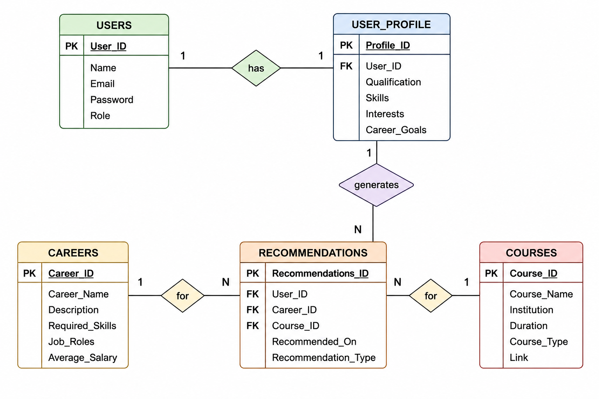

# ONE-STOP PERSONALIZED CAREER AND EDUCATION ADVISOR

## PROJECT OVERVIEW

🔸 The One-Stop Personalized Career and Education Advisor is a web-based platform designed to assist students in making informed academic and career decisions. The system provides personalized career recommendations, educational guidance, skill development suggestions, and learning resources based on user interests, qualifications, and career goals.

## PROBLEM STATEMENT

🔸 Many students face difficulties in selecting the right career path and educational opportunities due to a lack of personalized guidance and reliable information. Career-related resources, educational options, and skill development opportunities are often scattered across multiple platforms, making decision-making challenging. This project aims to provide a centralized platform that offers personalized career recommendations and educational guidance to help students achieve their academic and professional goals.


## REQUIREMENT GATHERING

🔸 Gathered and analyzed the functional and non-functional requirements of the system.

🔸 Identified the needs of students seeking career guidance and educational recommendations.

🔸 Collected information about career paths, educational opportunities, skill development resources, and user preferences.

🔸 Defined the core features required for personalized career and education recommendations.

# OBJECTIVE

🔸 Provide personalized career recommendations based on user interests and qualifications.

🔸 Offer educational guidance and course recommendations.

🔸 Suggest skill development opportunities and learning resources.

🔸 Help students make informed academic and professional decisions.

🔸 Create a centralized platform for career and education planning.
## USER AND MODULE IDENTIFICATION

🔸 Identified the primary users of the system, including students and administrators.

🔸 Analyzed user requirements and system interactions.

🔸 Defined the major modules required for the application.

🔸 Structured the system architecture to ensure smooth communication between modules.

## MODULE LIST

🔸 User Registration and Login Module

🔸 Career Recommendation Module

🔸 Education Guidance Module

🔸 Skill Development Module

🔸 Learning Resources Module

🔸 User Profile Management Module

🔸 Dashboard Module

🔸 Admin Management Module
## Use Case Diagram


## Database Requirement Analysis

| Table Name | Attributes | Description |
|------------|------------|-------------|
| Users | User_ID (PK), Name, Email, Password, Role | Stores user account information. |
| User_Profile | Profile_ID (PK), User_ID (FK), Qualification, Skills, Interests, Career_Goals | Stores user details and career goals. |
| Careers | Career_ID (PK), Career_Name, Description, Required_Skills | Contains career information. |
| Courses | Course_ID (PK), Course_Name, Institution, Duration | Stores course details. |
| Recommendations | Recommendation_ID (PK), User_ID (FK), Career_ID (FK), Course_ID (FK) | Stores personalized recommendations. |
## ER Diagram


# SQL SCHEMA

## User Table

```sql
-- Stores user information and career interests

CREATE TABLE users (
    user_id INT PRIMARY KEY,
    full_name VARCHAR(100),
    email VARCHAR(100),
    password VARCHAR(255),
    career_interest VARCHAR(100)
);
```

## Career Table

```sql
-- Stores career details and descriptions

CREATE TABLE careers (
    career_id INT PRIMARY KEY,
    career_name VARCHAR(100),
    description TEXT
);
```

## Education Table

```sql
-- Stores educational courses and institutions

CREATE TABLE education (
    education_id INT PRIMARY KEY,
    course_name VARCHAR(100),
    institution_name VARCHAR(100),
    career_id INT,
    FOREIGN KEY (career_id) REFERENCES careers(career_id)
);
```

## Skills Table

```sql
-- Stores skills related to different careers

CREATE TABLE skills (
    skill_id INT PRIMARY KEY,
    skill_name VARCHAR(100),
    career_id INT,
    FOREIGN KEY (career_id) REFERENCES careers(career_id)
);
```

## Learning Resources Table

```sql
-- Stores learning resources for skill development

CREATE TABLE learning_resources (
    resource_id INT PRIMARY KEY,
    resource_name VARCHAR(100),
    resource_type VARCHAR(50),
    skill_id INT,
    FOREIGN KEY (skill_id) REFERENCES skills(skill_id)
);
```
## UI WIREFRAME DESIGN

The UI Wireframe Design defines the structure and layout of the application screens. It helps visualize how users will interact with the system.

---

## LOGIN PAGE WIREFRAME

The Login Page Wireframe represents the user authentication screen. It includes fields for email and password along with a login button and registration option for new users.

+----------------------------------+
|            LOGIN PAGE            |
+----------------------------------+
| Email:    [______________]       |
| Password: [______________]       |
|                                  |
|         [ Login ]                |
|                                  |
|   New User? Register Here        |
+----------------------------------+

---

## DASHBOARD PAGE WIREFRAME

The Dashboard Page Wireframe shows the main user interface after login. It displays career recommendations, education guidance, and skill development options in a structured layout.

+--------------------------------------------------+
|                   DASHBOARD                      |
+--------------------------------------------------+
| Welcome, User!                                   |
+--------------------------------------------------+
| Career Recommendations                           |
| - Software Developer                             |
| - Data Analyst                                   |
| - Cybersecurity Analyst                          |
+--------------------------------------------------+
| Education Guidance                               |
| - Courses & Certifications                       |
+--------------------------------------------------+
| Skill Development                                |
| - Programming, Communication, Problem Solving    |
+--------------------------------------------------+

--
## LOGIN PAGE DEVELOPMENT

The Login Page was developed using HTML and CSS. The page includes email and password input fields, a login button, and a registration link for new users. The interface is designed to provide a simple and user-friendly authentication experience.


## REGISTRATION PAGE DEVELOPMENT

The Registration Page was developed using HTML and CSS to allow new users to create an account. The page includes fields for user details such as name, email, password, and career interests. The design ensures a simple and user-friendly registration process.

---

## REGISTRATION PAGE WIREFRAME

+----------------------------------+
|        REGISTRATION PAGE         |
+----------------------------------+
| Name:     [______________]       |
| Email:    [______________]       |
| Password: [______________]       |
| Interest: [______________]       |
|                                  |
|       [ Register ]               |
|                                  |
| Already a User? Login Here       |
+----------------------------------+

---

## DASHBOARD DEVELOPMENT

The Dashboard Page was developed to provide users with a centralized view of career recommendations, educational guidance, skill development suggestions, and learning resources. The dashboard is designed to enhance user experience through easy navigation and organized information display.

---

## DASHBOARD WIREFRAME

+--------------------------------------------------+
|                   DASHBOARD                      |
+--------------------------------------------------+
| Welcome, User!                                   |
+--------------------------------------------------+
| Career Recommendations                           |
| - Software Developer                             |
| - Data Analyst                                   |
| - Cybersecurity Analyst                          |
+--------------------------------------------------+
| Education Guidance                               |
| - Recommended Courses                            |
| - Certifications                                 |
+--------------------------------------------------+
| Skill Development                                |
| - Programming                                    |
| - Communication                                  |
| - Problem Solving                                |
+--------------------------------------------------+

---

## NAVIGATION & FORM DESIGN

The Navigation and Form Design module was created to provide seamless interaction within the One-Stop Personalized Career and Education Advisor system. User-friendly navigation menus and responsive forms were designed to facilitate smooth access to different modules and efficient data collection.
# DESIGN REVIEW

The design of the One Stop Personalized Career and Education Advisor was reviewed successfully. The navigation flow, forms, and recommendation features were verified to ensure a simple and user-friendly experience. The design is finalized and ready for implementation.
