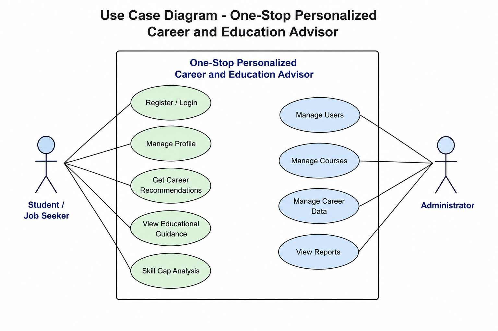

PROJECT TITLE:

One-Stop Personalized Career and Education Advisor

PROBLEM STATEMENT:

Students and job seekers often struggle to choose suitable career paths and educational opportunities due to a lack of personalized guidance and scattered information. This project aims to provide personalized career recommendations, educational guidance, and skill development suggestions based on users' interests, qualifications, and career goals. The system helps users make informed decisions and plan their future effectively.

REQUIREMENT GATHERING

The requirement gathering phase focuses on identifying the needs of users and stakeholders for the One-Stop Personalized Career and Education Advisor system.

Functional Requirements:
1. User registration and login.
2. Profile management for educational and career details.
3. Career recommendation based on user interests and skills.
4. Education guidance and course suggestions.
5. Skill gap analysis and improvement recommendations.
6. Search and filter career opportunities.
7. Admin dashboard for managing data and users.

Non-Functional Requirements:
1. User-friendly interface.
2. Secure user authentication and data privacy.
3. Fast and accurate recommendation system.
4. Scalable and reliable architecture.
5. Cross-platform accessibility.

Outcome:
The gathered requirements ensure that the system provides personalized career and educational guidance, helping users make informed decisions about their future.

OBJECTIVE DEFINITION

The objective of the One-Stop Personalized Career and Education Advisor is to provide users with personalized career guidance and educational recommendations based on their interests, skills, qualifications, and goals. The system aims to assist students and job seekers in making informed career decisions, identifying skill gaps, exploring suitable educational opportunities, and planning their professional growth effectively.

USER AND MODULE IDENTIFICATION

Users:
1. Student/Job Seeker
   - Create and manage profile
   - Receive career recommendations
   - Explore educational opportunities
   - View skill development suggestions

2. Administrator
   - Manage users and system data
   - Update career and course information
   - Monitor system activities

Modules:
1. User Authentication Module
   - Registration and login functionality

2. User Profile Module
   - Manage personal, educational, and skill details

3. Career Recommendation Module
   - Suggest suitable career paths based on user data

4. Education Guidance Module
   - Recommend courses, certifications, and institutions

5. Skill Gap Analysis Module
   - Identify missing skills and suggest improvements

6. Admin Module
   - Manage users, careers, and educational data
## Use Case Diagram

## Database Requirement Analysis

| Table Name | Attributes | Description |
|------------|------------|-------------|
| Users | User_ID (PK), Name, Email, Password, Role | Stores user account information. |
| User_Profile | Profile_ID (PK), User_ID (FK), Qualification, Skills, Interests, Career_Goals | Stores user details and career goals. |
| Careers | Career_ID (PK), Career_Name, Description, Required_Skills | Contains career information. |
| Courses | Course_ID (PK), Course_Name, Institution, Duration | Stores course details. |
| Recommendations | Recommendation_ID (PK), User_ID (FK), Career_ID (FK), Course_ID (FK) | Stores personalized recommendations. |
